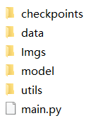
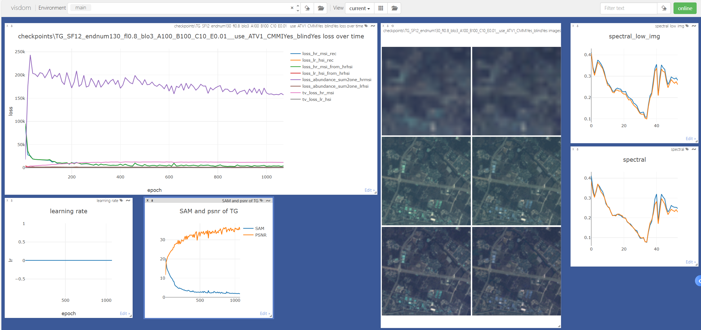

# XINet_TGRS
X-Shaped Interactive Autoencoders With Cross-Modality Mutual Learning for Unsupervised Hyperspectral Image Super-Resolution, TGRS. (PyTorch)
<!--
[Jiaxin Li 李嘉鑫](https://www.researchgate.net/profile/Li-Jiaxin-20), [Ke Zheng 郑珂](https://www.researchgate.net/profile/Ke-Zheng-9), [Zhi Li 李智](https://ieeexplore.ieee.org/author/37085683916),  [Lianru Gao 高连如](https://scholar.google.com/citations?hl=en&user=f6OnhtcAAAAJ), and [Xiuping Jia 贾秀萍](https://scholar.google.com/citations?user=-vl0ZSEAAAAJ&hl=zh-CN)，IEEE Transactions on Geoscience and Remote Sensing (TGRS). 

文章可在这里下载🖼️[**PDF**](./Imgs/XINet.pdf)，The final version can be downloaded in  🖼️[**PDF**](./Imgs/XINet.pdf) 

# $\color{red}{欢迎添加 我的微信(WeChat): BatAug，欢迎交流与合作}$

## 本人还提出了其余多个开源的高光谱-多光谱超分融合代码，可移步至[GitHub主页下载](https://github.com/JiaxinLiCAS) 

### 我是李嘉鑫，25年毕业于中科院空天信息创新研究院的直博生，导师高连如研究员 ###

我的英文版本个人简历可在隔壁仓库下载，如您需要此简历模板可以通过微信联系我。
My english CV can be downloaded in this repository .

2025.09——, 就职于重庆邮电大学 计算机科学与技术学院 文峰副教授 $\color{red}{博后导师：韩军伟教授}$ 
【[官网](https://teacher.nwpu.edu.cn/hanjunwei.html)，[谷歌学术主页](https://scholar.google.com/citations?user=xrqsoesAAAAJ&hl=zh-CN&oi=ao)】

2020.09-2025.07 就读于中国科学院 空天信息创新研究院 五年制直博生 $\color{red}{导师：高连如研究员}$ 【[导师空天院官网](https://people.ucas.ac.cn/~gaolianru)，[谷歌学术主页](https://scholar.google.com/citations?user=La-8gLMAAAAJ&hl=zh-CN)】

2016.09-2020.7 就读于重庆大学 土木工程学院 测绘工程专业

From 2025.09, I work at the School of Computer Science and Technology (National Exemplary Software School), Chongqing University of Posts and Telecommunications, as a Wenfeng associate professor.
My postdoctoral supervisor is [Junwei Han](https://scholar.google.com/citations?user=La-8gLMAAAAJ&hl=zh-CN).

From 2020.09 to 2025.07, I am a PhD candidate at the Key Laboratory of Computational Optical Imaging Technology, Aerospace Information Research Institute, Chinese Academy of Sciences, Beijing, China.
My supervisor is [Lianru Gao](https://scholar.google.com/citations?user=La-8gLMAAAAJ&hl=zh-CN).

From 2016.0 to 2020.7, I studied in the school of civil engineering at Chongqing University, Chongqing, China, for a Bachelor of Engineering.

这是我的[谷歌学术](https://scholar.google.com/citations?user=aSPDpmgAAAAJ&hl=zh-CN)和[ResearchGate](https://www.researchgate.net/profile/Jiaxin-Li-lijiaxin?ev=hdr_xprf)，More information can be found in my [Google Scholar Citations](https://scholar.google.com/citations?user=aSPDpmgAAAAJ&hl=zh-CN) and my [ResearchGate](https://www.researchgate.net/profile/Jiaxin-Li-lijiaxin?ev=hdr_xprf)
-->

# 代码解析 👇 有助你读懂代码 便于复现

🖼️**遇到任何问题，包括但不限于代码调试、数据仿真、运行结果等，随时添加**
$\color{red}{我的微信(WeChat): BatAug，欢迎交流与合作}$

**Fig.1.** Overall Pipeline of proposed method, abbreviated as XINet, for the task of unsupervised hyperspectral image super-resolution.

## 文件结构 Directory structure

**Fig.2.** Directory structure. There are four folders and one main.py file in XINet_TGRS-main.

### checkpoints
这个文件夹用于储存训练中的所有结果，这里给出了TG数据的示例。如果你直接运行main.py,将会在`TG_SF12_endnum130_fl0.8_blo3_A100_B100_C10_E0.01__use_ATV1_CMMIYes_blindYes`文件夹中生成以下的这些文件

This folder is used to store the results and a folder named `TG_SF12_endnum130_fl0.8_blo3_A100_B100_C10_E0.01__use_ATV1_CMMIYes_blindYes` is given as an example.

- `BlindNet.pth` is the trained parameters of the degradation model. 因为本方法是盲融合，因此需要估计未知的PSF和SRF

- `estimated_psf_srf.mat` is the estimated PSF and SRF. 估计到的PSF和SRF

- `hr_msi.mat` and `lr_hsi.mat`  are simulated results as the input of our method. 由输入的TG数据仿真得到的LrHSI和HrMSI

- `opt.txt` is the configuration of our method. 存储本次实验的所有配置，包括超参数以及数据名称等，由model里的config.py决定

- `psf_gt.mat` and  `srf_gt.mat` are the GT PSF and SRF. PSF 和 SRF的真值

- `Out.mat` is the final estimation. 本方法最终重建结果

- `loss_log.txt` is the training loss in the training process. 记录训练过程的损失变化

- `precision.txt` is the training accuracy in the training process. 记录训练过程的精度变化
  
- `psnr_and_sam.pickle` is the psnr and sam accuracy in the training process. 保存训练过程的PSNR 和 SAM
  
### data
This folder is used to store the ground true HSI and corresponding spectral response of multispectral imager, aiming to generate the simulated inputs. The TianGong-1 HSI data and spectral response of WorldView 2 multispectral imager are given as an example here.

这里给出了一个示例。XINet文件里的TG文件夹是TG数据的真值，spectral_response是用来仿真HrMSI的光谱响应函数。

### model
This folder consists of six .py files, including 
- `__init__.py`

- `config.py`: all the hyper-parameters can be adjusted here. 本方法所有需要调整的参数，包含数据读取地址以及模型超参数等

- `evaluation.py`: to evaluate the metrics. 评价指标计算

- `network.py`: the network used in our model. 本方法使用到的网络模块

- `read_data.py`: read and simulate data. 读取数据和仿真数据

- `fusion.py`: XINet. 重建融合主网络

- `srf_psf_layer.py`: the network to estimate PSF and SRF. 用于估计PSF和SRF，作为XINet的输入

### utils
This folder consists of four .py files, including 
- `__init__.py`

- `evaluation.py`: to evaluate the metrics. 评价指标计算

- `util.py`: some tools. 一些工具函数

- ❗`visualizer.py`: to display the training results. **用于可视化训练中的结果，基于Visdom可视化包**  

### main
- `main.py`: main.py 运行该文件，生成目标图像

## 如何运行我们的代码 How to run our code
1. Requirements: codes of networks were tested using PyTorch 1.9.0 version (CUDA 11.4) in Python 3.8.10 on Windows system.

2. Parameters: all the parameters need fine-tunning can be found in `config.py`. 本方法所有需要调整的参数都在此.py中

3. Data: put your HSI data and MSI spectral response in `./data/XINet/TG` and `./data/XINet/spectral_response`, respectively. The TianGong-1 HSI data and spectral response of WorldView 2 multispectral imager are given as an example here.

  将你的高光谱数据以及用于仿真HrMSI的光谱响应放到对应文件夹中，这里用TG数据作为示例

4. You should download the Visdom via pip or conda, and then type 'visdom -port 8500' into the terminal (the number should be identical to the --display_port in the model/config.py. Last, you can enter the site(http://localhost:8500/) the terminal give to you)

  **因为本方法使用了Visdom可视化包实现对训练过程的可视化，因此Vidsom包的安装是必备过程。以下将简单介绍Visdom包的安装和使用：**

  4.1 在你所在环境中 使用 conda/pip install visdom，完成对工具包的安装。具体过程可见[此](https://cloud.tencent.com/developer/article/2053918)
  
  4.2 安装成功后，同时按下WIN+R，输入CMD进入终端，在你所在环境的终端里输入 visdom -port 8500 **（注意：后面的数字可以随意，但需要跟model/config.py里面的--display_port参数保持一致)** 。

  此时，终端会提示你进入 http://localhost:8500/ 网址，复制该地址进入浏览器。这个网站后续就会可视化训练的过程。

  更多关于Visdom可视化方法可见[此](https://blog.csdn.net/2401_88244350/article/details/143364300)
  
5. Run: just simply run `main.py` after adjusting the parameters in `config.py`.
  在对应文件夹放置你的数据后，调整 `config.py`后的参数，即可运行`main.py`

  **当你觉得效果欠佳时，可以调整里面的 -endmember_num 个数。**
   
7. Results: one folder named `TG_SF12_endnum130_fl0.8_blo3_A100_B100_C10_E0.01__use_ATV1_CMMIYes_blindYes` will be generated once `main.py` is run and all the results will be stored in the new folder. Also, you can observe the training process in the above-opened site via Visdom.
  当你运行本代码后，将会生成`TG_SF12_endnum130_fl0.8_blo3_A100_B100_C10_E0.01__use_ATV1_CMMIYes_blindYes` 文件夹，里面存储所有结果.

  同时，你可以在刚才打开的网站里实时监控整个训练过程,如下图所见.

  6.1 左上角代表每个损失随着训练的变化过程。左下角分别是学习率的变化以及PSNR-SAM的变化。
  
  6.2 中间可视化6张图。第一列分别是LrHSI HrMSI HrHSI真值，右侧分别代表自编码器重建出来的结果

  
  **注意：当你发现第二列一直为黑色，可以中断程序，换一个随机种子再次运行**
  
  6.3 右侧两张图。上方lrhsi真值以及自编码重建出来的lrhsi在相同位置的光谱曲线，下方代表HrHSI以及重建HrHSI在相同位置的光谱曲线。注意：在每轮可视化的时候，选取的像素位置都会变化。

**Fig.3.** Visdom visualization.

## 如何联系我们 Contact
遇到任何问题，包括但不限于代码调试、数据仿真、运行结果等，随时添加
$\color{red}{我的微信(WeChat): BatAug，欢迎交流与合作}$

If you encounter any bugs while using this code, please do not hesitate to contact us. lijiaxin203@mails.ucas.ac.cn

